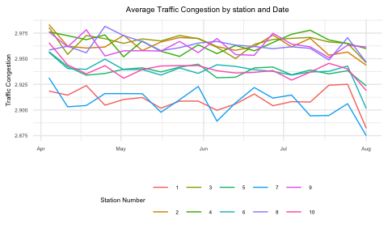

# Introduction:

The database is grouped at *weekly* level

To identify what is going on with the database we perform some
exploratory data analysis

We can see that the average speed decreases for Azzurropoli

Now we can check the other variables…

We can notice from the two graphs above that we have a “sharp” decrease
in crashes and deaths

We instead have an increase in Petrol consumption for Azzurropoli

While for the other variables we have same behaviour

Checking that the population density is constant…

Checking if the weather is constant…

We have now understood that something happened to the variables:

- `speed`
- `carCrash`
- `pedestrianDeath`
- `energyConsumption`

The only variable that can be the cause for the other variables is
speed.

How the cities differ?

Let’s plot the cities characteristics

| cityName    | population | size | popDensity | city |
|:------------|-----------:|-----:|-----------:|:-----|
| Azzurropoli |     379909 |  192 |       1979 | 1    |
| Biancavilla |     453991 |   91 |       4989 | 2    |
| Lavandonia  |     271008 |  363 |        747 | 3    |
| Celestopoli |     152110 |  454 |        335 | 4    |
| Plumbeopoli |      52620 |  394 |        134 | 5    |
| Aranciopoli |     303659 |  183 |       1659 | 6    |

We subset the the traffic dataset at station level and plot the
differences between the stations

As we can see from the graphs, station 4 and 7 are not treated, they
still have the same speed levels.

We can also see that there do not decrease the average car crash per
week and in number 4 do not decrease average pedestrianDeath
