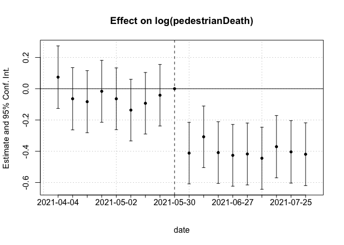

# Analyis

## City Level

According to the analysis before the towns identified with numbers:
1,2,6 are similar for carCrash and pedestrianDeath, or in another way,
they have parallel trends before the treatment

### Diff-in-Diff

``` r
# we create the variable treated if city is treated

traffic_city <- traffic_city %>%
  mutate(treated = if_else(city == 1, 1, 0))

traffic_city <- traffic_city %>%
  mutate(after = if_else(date >= as.Date("2021-06-01"),1, 0))

# similar towns subset
similar_towns <-subset(traffic_city,city %in%c(1,2,6))
```

We create a dummy variable called treated that takes values 1 if the
city is city 1 and 0 otherwise

Let’s take pedestrianDeath as independent variable and write a simple
difference-in-difference regression

$$ Y = \beta_0 + \beta_1 \times \text{Treatment} + \beta_2 \times \text{Post} + \beta_3 \times \text{Treatment} \times \text{Post} + \epsilon $$

where:

- $Y$ is the dependent variable,
- $\beta_0$ is the intercept,
- $\beta_1$ represents the effect of the treatment (before and after),
- $\beta_2$ captures the time effect (difference between pre and post),
- $\beta_3$ is the interaction term that provides the
  Difference-in-Differences estimator (the effect of the treatment after
  the treatment relative to before),
- $\text{Treatment}$ is a dummy variable indicating whether the
  observation is in the treatment group or control group,
- $\text{Post}$ is a dummy variable indicating the post-treatment
  period,
- $\epsilon$ represents the error term, capturing all other factors
  affecting $Y$ not included in the model.

|                                | city_regression_pe..                     |
|:-------------------------------|:-----------------------------------------|
| Dependent Var.:                | pedestrianDeath                          |
|                                |                                          |
| Constant                       | 0.0004\*\*\* (6.07e-6)                   |
| after                          | -2.5e-6 (8.58e-6)                        |
| treated                        | 4.84e-7 (1.05e-5)                        |
| after x treated                | -0.0001\*\*\* (1.49e-5)                  |
| \_\_\_\_\_\_\_\_\_\_\_\_\_\_\_ | \_\_\_\_\_\_\_\_\_\_\_\_\_\_\_\_\_\_\_\_ |
| S.E. type                      | IID                                      |
| Observations                   | 54                                       |
| R2                             | 0.74343                                  |
| Adj. R2                        | 0.72804                                  |

Interpreting the results:

We have a constant value of 0.0004 deaths every week which is
statistically significant at 1% level and after x treated -0.0001 with
significance level also at 1%.

So After the treatment we have a decrease in deaths of 0.0001.

Small recap:

- the significance codes stands for p values \< 0.01 \*\*\* , p \< 0.05
  \*\* , p \< 0.10 \*)
- More precisely, a study’s defined significance level, denoted by
  $\alpha$ , is the probability of the study rejecting the null
  hypothesis, given that the null hypothesis is true; and the p-value of
  a result, p , is the probability of obtaining a result at least as
  extreme, given that the null hypothesis is true.

But what does this mean?

To have a better understanding we can run the regression using the
logarithm, to get the variation

$$ log(Y) = \beta_0 + \beta_1 \times \text{Treatment} + \beta_2 \times \text{Post} + \beta_3 \times \text{Treatment} \times \text{Post} + \epsilon $$

|                                | city_regression_pe..                     | city_regression_pe..                     |
|:-------------------------------|:-----------------------------------------|:-----------------------------------------|
| Dependent Var.:                | pedestrianDeath                          | log(pedestrianDeath)                     |
|                                |                                          |                                          |
| Constant                       | 0.0004\*\*\* (6.07e-6)                   | -7.855\*\*\* (0.0159)                    |
| after                          | -2.5e-6 (8.58e-6)                        | -0.0070 (0.0225)                         |
| treated                        | 4.84e-7 (1.05e-5)                        | 0.0019 (0.0276)                          |
| after x treated                | -0.0001\*\*\* (1.49e-5)                  | -0.3406\*\*\* (0.0390)                   |
| \_\_\_\_\_\_\_\_\_\_\_\_\_\_\_ | \_\_\_\_\_\_\_\_\_\_\_\_\_\_\_\_\_\_\_\_ | \_\_\_\_\_\_\_\_\_\_\_\_\_\_\_\_\_\_\_\_ |
| S.E. type                      | IID                                      | IID                                      |
| Observations                   | 54                                       | 54                                       |
| R2                             | 0.74343                                  | 0.79513                                  |
| Adj. R2                        | 0.72804                                  | 0.78284                                  |

Interpreting the coefficients:

Method 1:

The expected deaths are 100 ∗ $(exp(\beta_3)-1)$ can be interpreted as
the percentage change in Y when is after AND treated , holding
everything else constant.

In this case 100 ∗ $(exp(0.34)-1) \approx$ 40.49476 % increase

Method 2:

In this case 100 ∗ $0.34 \approx$ 34.49476 % increase

100 ∗ $\beta_3$ can be interpreted as the percentage change in Y when is
after AND treated , holding everything else constant. Works better if
$\beta_3$ is close to 0

Now we can see that after the treatment we have a 34% decrease in deaths
in the treated city after reducing the speed in city 1

Using the same on car crashes:

|                                | city_regression_car                      | city_regression_c..                    |
|:-------------------------------|:-----------------------------------------|:---------------------------------------|
| Dependent Var.:                | carCrash                                 | log(carCrash)                          |
|                                |                                          |                                        |
| Constant                       | 0.0029\*\*\* (2.07e-5)                   | -5.837\*\*\* (0.0074)                  |
| after                          | -3.92e-6 (2.93e-5)                       | -0.0011 (0.0105)                       |
| treated                        | -2.62e-6 (3.58e-5)                       | -0.0010 (0.0128)                       |
| after x treated                | -0.0009\*\*\* (5.07e-5)                  | -0.3497\*\*\* (0.0181)                 |
| \_\_\_\_\_\_\_\_\_\_\_\_\_\_\_ | \_\_\_\_\_\_\_\_\_\_\_\_\_\_\_\_\_\_\_\_ | \_\_\_\_\_\_\_\_\_\_\_\_\_\_\_\_\_\_\_ |
| S.E. type                      | IID                                      | IID                                    |
| Observations                   | 54                                       | 54                                     |
| R2                             | 0.93559                                  | 0.94928                                |
| Adj. R2                        | 0.93172                                  | 0.94623                                |

We obtain similar results to pedestrianDeath regression

### Event Study

Now we are going to perform an Event study at city level to visually
represent the results

What it is an event study?

*An event study is a statistical method to assess the impact of an event
(also referred to as a “treatment”)*

for reference:
<https://lost-stats.github.io/Model_Estimation/Research_Design/event_study.html>

My code will be in R, but you can use the code in python provided by
this guy.

where:

- $\text{pedestrianDeath}$ is the dependent variable
- $\alpha$ is the intercept of the linear model
- $\beta$ is the slope of the linear model that describes the effect of
  treatment
- $\epsilon_{i,t}$ represents the error terms, which are assumed to be
  normally distributed with mean zero and constant variance

In simpler terms, the event study will provide a coefficient $\beta$ for
each time observation (could be days, months years…)

You should obtain something like this:

<!-- -->

As you can notice from the values on the y-axis, it is not very
comprehensible, since, luckily, not many people are dying every week
from car crashes.

The interpretation is that after the change in speed there are 0.00015
deaths due to cars in the city treated with respect to the others
controlled.

As you can see the confidence intervals are quite large we can “control”
for other characteristics:

$$ pedestrianDeath = \alpha + \beta \times After_t + \chi_{i} + \epsilon_{i_t} $$
Here $\chi$ stands for the vector of control variables that in this case
are log(population) + log(size) + log(popDensity)

<!-- -->

To have a better understanding, we can use the log to have the variation

<!-- -->

The confidence intervals cross the 0 line before the treatment, so we
can claim there is no effect before the treatment with respect to the
point 0 (marked with dashed line)

Using date fixed effects to keep into account unobserved characteristics

<!-- -->

As you can see, the confidence intervals are way smaller when using
fixed effects

Doing the same for car crash

<!-- --><!-- --><!-- -->

Now we perform the study at station level, we analyze the treated
stations against the non-treated ones. The treated one will assume value
1 if are in city 1 and are not 4 and 7 (we saw that the speed was not
altered in them).

<!-- ```{r} -->
<!-- station_regression_pedestrian <- feols(pedestrianDeath ~ treated + date + i(date,treated, ref = as.Date("2021-05-30")) + log(population) + log(size) , data = traffic_station) -->
<!-- iplot(station_regression_pedestrian) -->
<!-- station_regression_crash<- feols(carCrash ~ treated + i(date,treated, ref = as.Date("2021-05-30")) + log(population) + log(size) , data = traffic_station) -->
<!-- iplot(station_regression_crash) -->
<!-- station_regression_pedestrian <- feols(log(pedestrianDeath) ~ treated + date + i(date,treated, ref = as.Date("2021-05-30"))+ log(population) + log(size) , data = traffic_station) -->
<!-- iplot(station_regression_pedestrian) -->
<!-- station_regression_crash<- feols(log(carCrash) ~ treated + i(date,treated, ref = as.Date("2021-05-30")) + log(population) + log(size)  , data = traffic_station) -->
<!-- iplot(station_regression_crash) -->
<!-- station_regression_pedestrian <- feols(log(pedestrianDeath) ~ treated + date + i(date,treated, ref = as.Date("2021-05-30"))+ log(population) + log(size) | station , data = traffic_station) -->
<!-- iplot(station_regression_pedestrian) -->
<!-- station_regression_crash<- feols(log(carCrash) ~ treated + i(date,treated, ref = as.Date("2021-05-30")) + log(population) + log(size) | station  , data = traffic_station) -->
<!-- iplot(station_regression_crash) -->
<!-- ``` -->

# Station level

<!-- ## Accross Cities  -->
<!-- We perform the same regressions with the data grouped at station level -->
<!-- ```{r, message=FALSE, warning=FALSE, echo=FALSE} -->
<!-- similar_towns_stations <- subset(traffic_station,city%in%c(1,2,6)) -->
<!-- ``` -->
<!-- ```{r, message=FALSE, warning=FALSE, echo=FALSE} -->
<!-- station_regression_pedestrian <- feols(pedestrianDeath ~ treated + i(date,treated, ref = as.Date("2021-05-30")) + log(population) + log(size) , data = similar_towns_stations) -->
<!-- station_regression_crash<- feols(carCrash ~ treated + i(date,treated, ref = as.Date("2021-05-30")) + log(population) + log(size) , data = similar_towns_stations) -->
<!-- station_regression_pedestrian_log <- feols(log(pedestrianDeath) ~ treated  + i(date,treated, ref = as.Date("2021-05-30"))+ log(population) + log(size) , data = similar_towns_stations) -->
<!-- station_regression_crash_log <- feols(log(carCrash) ~ treated + i(date,treated, ref = as.Date("2021-05-30")) + log(population) + log(size)  , data = similar_towns_stations) -->
<!-- station_regression_pedestrian_fixed <- feols(log(pedestrianDeath) ~ treated  + i(date,treated, ref = as.Date("2021-05-30"))+ log(population) + log(size) | station , data = similar_towns_stations) -->
<!-- station_regression_crash_fixed <- feols(log(carCrash) ~ treated + i(date,treated, ref = as.Date("2021-05-30")) + log(population) + log(size) | station  , data = similar_towns_stations) -->
<!-- ``` -->
<!-- ## Event study -->
<!-- ```{r, message=FALSE, warning=FALSE, echo=FALSE, fig.align='center'} -->
<!-- iplot(station_regression_pedestrian) -->
<!-- iplot(station_regression_pedestrian_log) -->
<!-- iplot(station_regression_pedestrian_fixed) -->
<!-- ``` -->
<!-- ```{r, message=FALSE, warning=FALSE, echo=FALSE, fig.align='center'} -->
<!-- iplot(station_regression_crash) -->
<!-- iplot(station_regression_crash_log) -->
<!-- iplot(station_regression_crash_fixed) -->
<!-- ``` -->

## Whitin the same city

### Difference-in-difference

Now we perform the analysis in the same city, considering all the
stations as treated, except for 4 and 7, that are the controls.

|                                | city_regression_p..                    | city_regression_pe..                     |
|:-------------------------------|:---------------------------------------|:-----------------------------------------|
| Dependent Var.:                | pedestrianDeath                        | log(pedestrianDeath)                     |
|                                |                                        |                                          |
| Constant                       | 0.0004\*\*\* (1.71e-5)                 | -7.840\*\*\* (0.0509)                    |
| after                          | -2.39e-5 (2.42e-5)                     | -0.0640 (0.0720)                         |
| treated                        | -1.86e-5 (1.91e-5)                     | -0.0412 (0.0570)                         |
| after x treated                | -0.0001\*\*\* (2.7e-5)                 | -0.3792\*\*\* (0.0805)                   |
| \_\_\_\_\_\_\_\_\_\_\_\_\_\_\_ | \_\_\_\_\_\_\_\_\_\_\_\_\_\_\_\_\_\_\_ | \_\_\_\_\_\_\_\_\_\_\_\_\_\_\_\_\_\_\_\_ |
| S.E. type                      | IID                                    | IID                                      |
| Observations                   | 180                                    | 180                                      |
| R2                             | 0.47763                                | 0.51265                                  |
| Adj. R2                        | 0.46872                                | 0.50434                                  |

|                                | city_regression_ca..                     | city_regression_c..                    |
|:-------------------------------|:-----------------------------------------|:---------------------------------------|
| Dependent Var.:                | carCrash                                 | log(carCrash)                          |
|                                |                                          |                                        |
| Constant                       | 0.0029\*\*\* (4.58e-5)                   | -5.858\*\*\* (0.0194)                  |
| after                          | 4.24e-5 (6.48e-5)                        | 0.0144 (0.0275)                        |
| treated                        | 6.54e-5 (5.12e-5)                        | 0.0229 (0.0217)                        |
| after x treated                | -0.0011\*\*\* (7.25e-5)                  | -0.4822\*\*\* (0.0307)                 |
| \_\_\_\_\_\_\_\_\_\_\_\_\_\_\_ | \_\_\_\_\_\_\_\_\_\_\_\_\_\_\_\_\_\_\_\_ | \_\_\_\_\_\_\_\_\_\_\_\_\_\_\_\_\_\_\_ |
| S.E. type                      | IID                                      | IID                                    |
| Observations                   | 180                                      | 180                                    |
| R2                             | 0.88244                                  | 0.88547                                |
| Adj. R2                        | 0.88044                                  | 0.88351                                |

Interpreting the results:

We have a 38% decrease in deaths and 48% Decrease in car crashes in the
treated stations in Azzurropoli

### Event study


